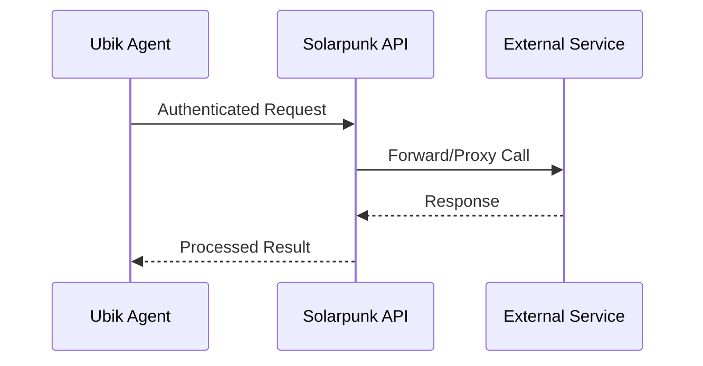

## Overview

Solarpunk supports seamless integrations with third-party services to extend your workflows. You can connect via APIs for real-time data exchange, configure webhooks for event-driven updates, or build custom tools for specialized needs. These integrations enable Ubik agents to interact with your ecosystem, automating decisions and actions across platforms.

<Callout kind="info">
Review your Solarpunk dashboard at `https://dashboard.example.com` to manage active integrations.
</Callout>

## Integration Types

Choose the right integration method based on your needs.

<Columns cols={3}>
  <Card title="API Connections" icon="zap" href="#api-connections">
    Direct API calls for authenticated data access.
  </Card>
  <Card title="Webhooks" icon="git-pull-request" href="#webhooks">
    Event notifications pushed to your endpoint.
  </Card>
  <Card title="Custom Tools" icon="tool" href="#custom-tools">
    Build bespoke integrations with Solarpunk's SDK.
  </Card>
</Columns>

## Third-Party API Connections

Connect to services like Slack, GitHub, or custom APIs using Solarpunk's integration endpoints.

### Slack Integration Example

Use the Solarpunk API to send messages to Slack channels.

<Request tabs="JavaScript,cURL" show-lines="true">
  ```javascript
  const response = await fetch('https://api.example.com/v1/integrations/slack/send', {
    method: 'POST',
    headers: {
      'Authorization': `Bearer ${YOUR_API_KEY}`,
      'Content-Type': 'application/json'
    },
    body: JSON.stringify({
      channel: '#general',
      text: 'Solarpunk agent completed task.'
    })
  });
  ```
  ```bash
  curl -X POST https://api.example.com/v1/integrations/slack/send \
    -H "Authorization: Bearer YOUR_API_KEY" \
    -H "Content-Type: application/json" \
    -d '{
      "channel": "#general",
      "text": "Solarpunk agent completed task."
    }'
  ```
</Request>

<Response tabs="200">
  ```json
  {
    "success": true,
    "message": "Message sent to Slack",
    "timestamp": "2024-10-15T10:30:00Z"
  }
  ```
</Response>

<ParamField path="channel" param-type="string" required="true">
  Slack channel name, e.g., `#general` or `C1234567890`.
</ParamField>

<ParamField header="Authorization" param-type="string" required="true">
  Bearer token from your Solarpunk dashboard.
</ParamField>

## Webhook Configuration

Set up webhooks to receive real-time events from Solarpunk, such as task completions or agent decisions.

<Steps>
  <Step title="Create Webhook" icon="plus">
    Navigate to `https://dashboard.example.com/integrations/webhooks` and click "New Webhook".
  </Step>
  <Step title="Configure Endpoint" icon="link">
    Enter your endpoint URL, e.g., `https://your-webhook-url.com/solarpunk`.
  </Step>
  <Step title="Select Events" icon="bell">
    Choose events like `agent.completed` or `decision.made`.
  </Step>
  <Step title="Verify Setup" icon="check-circle">
    Test with a sample payload and save.
  </Step>
</Steps>

Example webhook payload:

````json
{
  "event": "agent.completed",
  "data": {
    "task_id": "task-123",
    "outcome": "success",
    "timestamp": "2024-10-15T10:30:00Z"
  },
  "signature": "sha256=YOUR_SIGNATURE_HERE"
}
````

## Custom Tool Integrations

<Tabs>
  <Tab title="Node.js SDK" icon="nodejs">
    Install and use the Solarpunk SDK for custom agents.

    <CodeGroup tabs="npm,yarn">
      ````bash
      npm install @solarpunk/sdk
      ````
      ````bash
      yarn add @solarpunk/sdk
      ````
    </CodeGroup>

    ```javascript
    import { SolarpunkClient } from '@solarpunk/sdk';

    const client = new SolarpunkClient({ apiKey: 'YOUR_API_KEY' });
    const result = await client.tools.create({
      name: 'custom-tool',
      action: async (input) => { /* your logic */ }
    });
    ```
  </Tab>
  <Tab title="Python SDK" icon="python">
    Use the Python client for server-side integrations.

    ```python
    from solarpunk import Client

    client = Client(api_key="YOUR_API_KEY")
    result = client.tools.create(
        name="custom-tool",
        action=lambda input: f"Processed: {input}"
    )
    ```
  </Tab>
</Tabs>

## Security Best Practices

Protect your integrations with these guidelines.

<Callout kind="alert" title="Security Warning">
Always validate webhook signatures and use HTTPS endpoints. Store secrets securely and rotate API keys regularly.
</Callout>



<Expandable title="Advanced: Signature Verification" default-open="false">
Verify webhook payloads using HMAC-SHA256.

```javascript
const crypto = require('crypto');
const signature = req.headers['x-solarpunk-signature'];
const hash = crypto.createHmac('sha256', 'YOUR_WEBHOOK_SECRET')
  .update(JSON.stringify(payload))
  .digest('hex');
if (hash !== signature) {
  throw new Error('Invalid signature');
}
```
</Expandable>

For more, see [Authentication](/authentication) and [Quickstart](/quickstart).